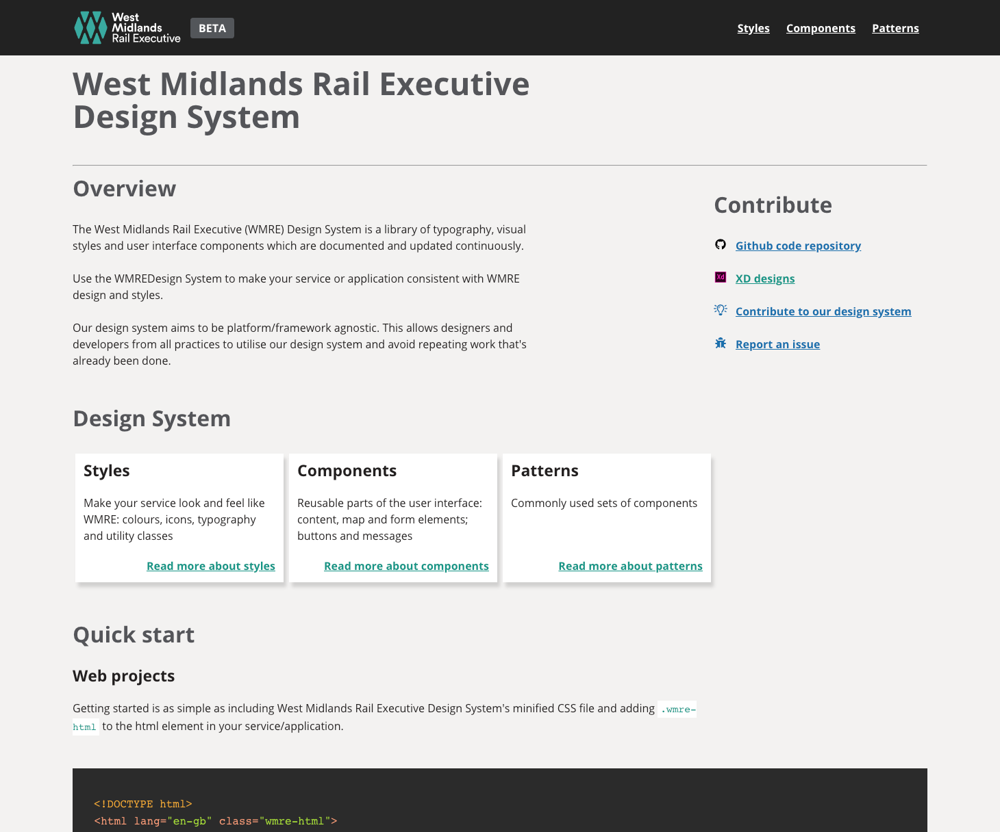

# 1. WMRE Design System

[](https://github.com/wmcadigital/wmre-design-system/commits/master)
[](https://github.com/wmcadigital/wmre-design-system/issues)

## 1.1. Table of contents

<!-- TOC -->

- [1. WMRE Design System](#1-wmre-design-system)
  - [1.1. Table of contents](#11-table-of-contents)
  - [1.2. Overview](#12-overview)
  - [1.3. Quick start](#13-quick-start)
  - [1.4. Tasks](#14-tasks)
    - [1.4.1. Starting web server](#141-starting-web-server)
    - [1.4.2. Linting](#142-linting)
    - [1.4.3. Compilation](#143-compilation)
    - [1.4.4. Clean up](#144-clean-up)
  - [1.5. Troubleshooting](#15-troubleshooting)
  - [1.6. Contributing to the code base](#16-contributing-to-the-code-base)
  - [1.7. Got feedback?](#17-got-feedback)

<!-- /TOC -->

## 1.2. Overview

Welcome to the [West Midlands Rail Executive Design System](https://wmcadigital.github.io/wmre-design-system).

The WMRE design system is ran at the designated url on startup (usually [http://localhost:3000](http://localhost:3000)) and is the primary means of viewing your work - it will live update as you make changes.

- Tailored for building West Midlands Rail Executive apps and websites: Using the WMRE Design System markup and CSS framework results in UIs that reflect the West Midlands Rail Executive look and feel.
- Continuously updated: As long as you're using the latest version of the WMRE Design System, your pages are always up to date with West Midlands Rail Executive UI changes.




## 1.3. Quick start

You'll need [Git](https://help.github.com/articles/set-up-git/) and [Node.js](https://nodejs.org/en/) installed to get this project running.

1. Clone the project with `git clone https://github.com/wmcadigital/wmre-design-system.git`
2. Run `npm install` in the root folder.
3. Run `npm start` to launch the dev environment with hot reloading.
4. Visit [http://localhost:3000](http://localhost:3000)

Having trouble getting these steps to work on your machine? Follow the [troubleshooting guide](doc/troubleshooting.md).

## 1.4. Tasks

For more in-depth information on what each task does, see [tasks guide](doc/contributing/tasks.md).

### 1.4.1. Starting web server

Start the WMRE Design System web server.

`npm start`

### 1.4.2. Linting

Lint the code base for syntax and stylistic errors.

See [Linting](./doc/contributing/tasks/linting.md) for more details.

```bash
# Lint indentation, Sass, JavaScript files, html
npm run lint:all

# Lint languages independently
npm run lint:styles
npm run lint:templates
npm run lint:scripts
```

### 1.4.3. Compilation

Build the design system for various environments

See [Building](./doc/contributing/tasks/building.md) for more details.

```bash
# Build Sass, JavaScript, HTML files
npm run build:all

# Build languages/assets independently
npm run build:styles
npm run build:templates
npm run build:scripts
npm run build:images
npm run build:sprites
npm run build:config
```

### 1.4.4. Clean up

Delete all built languages/assets including temporary build and local files.

`npm run clean`

## 1.5. Troubleshooting

See the [troubleshooting guide](doc/troubleshooting.md).

## 1.6. Contributing to the code base

See the [contributing guide](doc/contributing.md).

## 1.7. Got feedback?

Please open a new [Github Issue](https://github.com/wmcadigital/wmre-design-system/issues).
